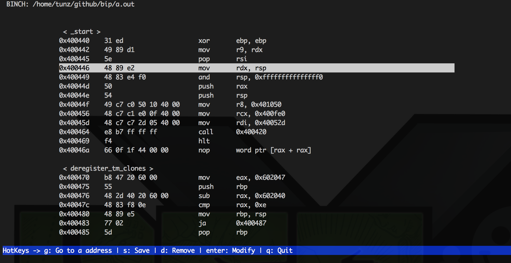

# a light BINary patCH tool
A light ELF binary patch tool in python urwid. It helps to patch a ELF binary in a few steps.



Now, it only supports x86 (+ x86_64). But I also have a plan to support ARM.

## Usage

```
$ ./binch [binary name]
```

#### Shortcuts
```
g: Go to a specific address. (if not exists, jump to nearest address)
d: Remove a current line. (Fill with nop)
q: Quit.
s: Save a modified binary to a file.
enter: Modify a current line.
```

## Dependencies
```
# pip install pyelftools
# pip install capstone
# pip install urwid
# pip install blinker
# apt-get install nasm
```
